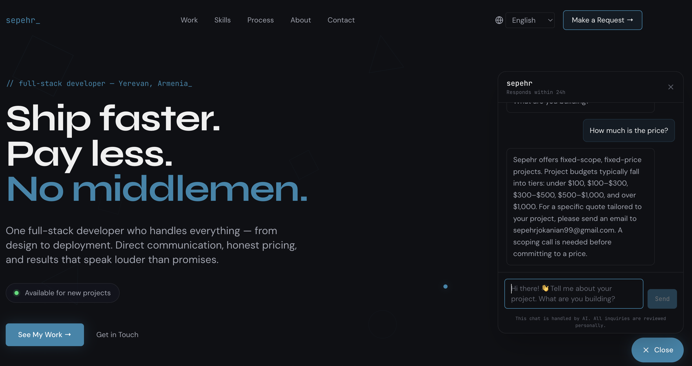
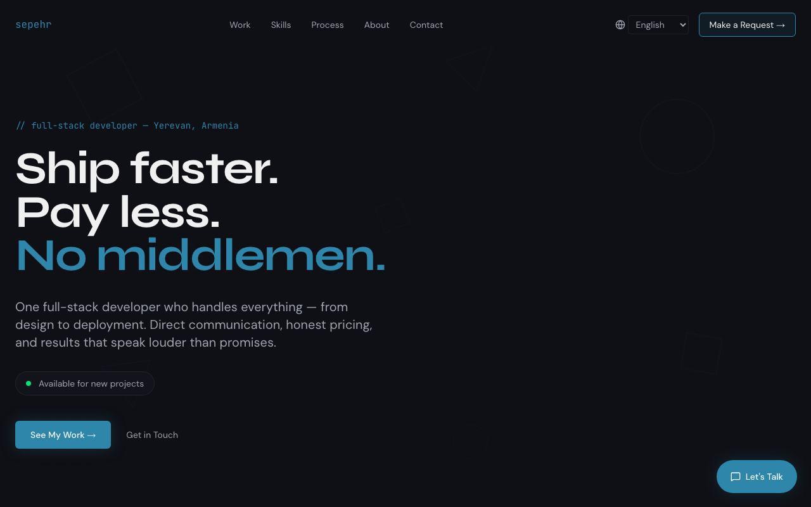
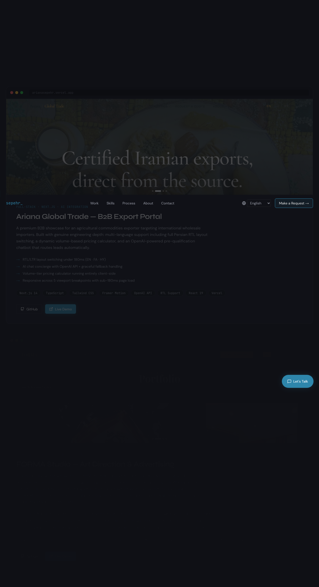
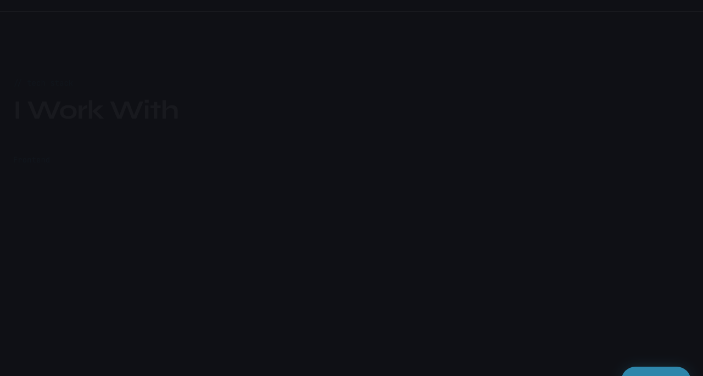
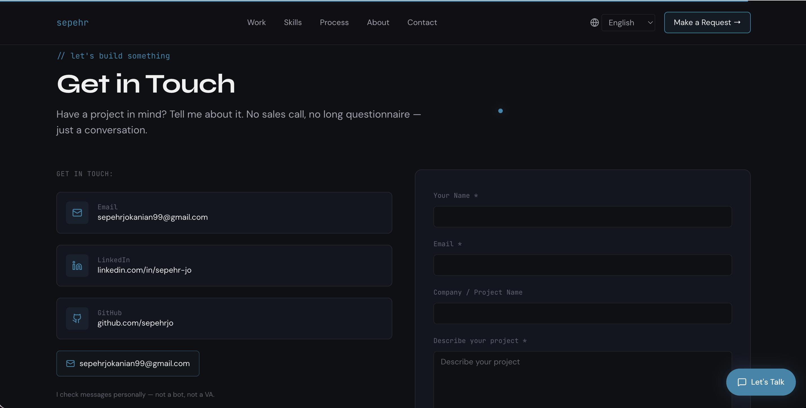
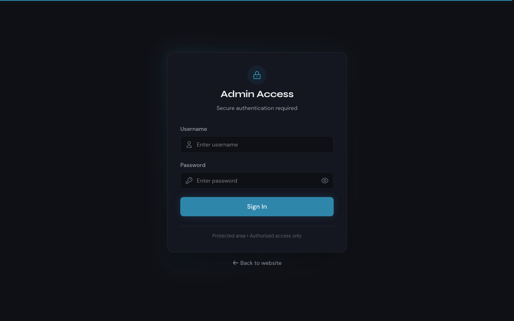

# portfolio-os

Live Demo: https://sep-web.pages.dev

A portfolio site built with TanStack Start, React, TypeScript, and Tailwind CSS, deployed on Cloudflare Pages. The codebase includes multilingual support (English, Armenian, Persian), animated components with Framer Motion, and a contact form with email notifications.

## Screenshots

The chatbot functionality in site.

The hero section with headline, availability status, and stat counters.

The projects section showing the portfolio works.

The skills section showing the tech stack.

The contact section with a message form.

The admin dashboard view without login.

Stack

Frontend: React 19 + TanStack Start + TypeScript
Styling: Tailwind CSS with RTL support
Database: Cloudflare D1 (SQLite)
Email: Resend API
Hosting: Cloudflare Pages + Workers
Animations: Framer Motion, Three.js
Translations: i18n with JSON files

Setup

Node.js 18+

npm install
npm run dev

Open http://localhost:5173

Environment Variables

Copy .dev.vars.example to .dev.vars and fill in your API keys:

OPENAI_API_KEY=your-openai-key-here
RESEND_API_KEY=your-resend-key-here

Get keys from OpenAI and Resend.

Internationalization

The site supports English, Armenian, and Persian. Language files are in src/lib/translations.json. The I18nProvider handles language switching in src/components/I18nProvider.tsx. For Persian, the layout switches to RTL automatically.

Database

Migrations are in the migrations/ folder. Set up your D1 database and update YOUR_DATABASE_ID in wrangler.toml, then run:

npx wrangler d1 execute portfolio-db --local --file=migrations/0001_create_contacts.sql

Building

npm run build

Deploying to Cloudflare Pages

npm run deploy

Make sure your Cloudflare account has D1, KV, and the required environment variables set up.

Project Structure

src/components/site/ — Public-facing components (Hero, Contact, Projects, etc.)
src/components/ui/ — Reusable UI components
src/lib/ — Utilities, i18n, database queries
src/routes/ — Public pages and API endpoints
src/styles/ — Global styles and RTL support
migrations/ — Database schema

License

ISC
